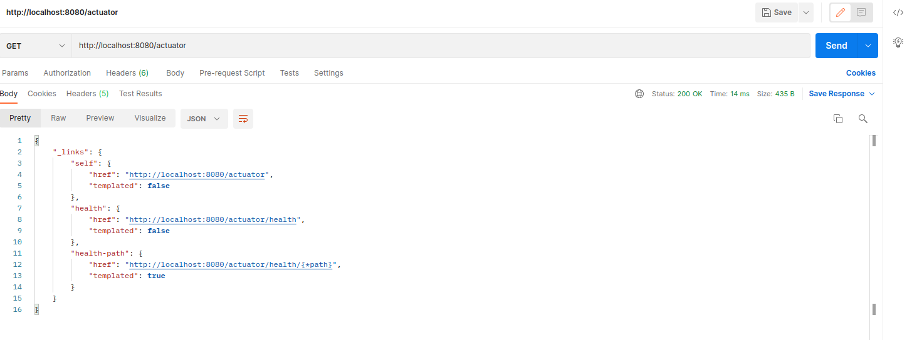

 
# PropertiesService
Stayhere Properties Service

# Run PropertiesService on local environment
Installations Needed
1. Install Java 11
2. [Install Apache Maven ](https://maven.apache.org/install.html)  to run spring boot
3. [Install Docker](https://docs.docker.com/engine/install/ubuntu/)

# Run local Development Mode
1. Navigate to root directory of the app and run `docker-compose up -d` to start mysql Database
2. Run `mvn spring-boot:run -e` to start the service 
3. Open your browser or Postman `http://localhost:8080/actuator` should get a json response with health details 

